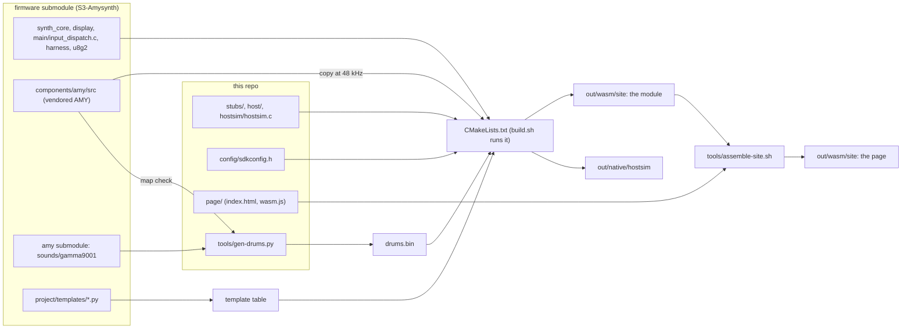

# amysynth-wasm

Builds the [S3-Amysynth](https://github.com/rt-rtos/S3-Amysynth) firmware's
application code and AMY engine for a host: natively, as `hostsim` (replay
logs, a step protocol over stdin), and with Emscripten as the static site at
<https://rt-rtos.github.io/amysynth-web/>.

The firmware is the `firmware` submodule, compiled as it is. This repo holds
only what the device has and a host does not: headers standing in for
ESP-IDF, FreeRTOS and the board's drivers (`stubs/`), their host
implementations (`host/`), the program that drives the firmware's boot,
input and render in place of its tasks (`hostsim/hostsim.c`), and the page.
[`SHIMS.md`](SHIMS.md) lists every one of them and what it changes. The firmware commit
the submodule pins is the one the site runs, and the page shows it.

## Building

    git clone --recurse-submodules <this repo>
    ./build.sh                     # native: out/native/hostsim
    source <emsdk>/emsdk_env.sh    # Emscripten, for the site
    ./build.sh wasm                # out/wasm/site, plus node builds of the module
    (cd out/wasm/site && python3 -m http.server)

Needs gcc, zlib, Python 3, CMake 3.28 or later, Ninja, and for the site an
Emscripten SDK (built here with emcc 6.0.11). `./build.sh san` is the
native build with ASan and UBSan; `./build.sh wasm --single` adds the site
as one HTML file that opens from disk. Everything else (the replay log
grammar, the step protocol, what is stood in for, how the wasm build
differs): [`hostsim/README.md`](hostsim/README.md).

`FW_ROOT=<checkout> ./build.sh ...` builds against another firmware checkout,
such as a working tree with uncommitted changes. The page's version string is
`git describe --tags --always --dirty` of the firmware tree, or
`HOSTSIM_VERSION`.

The build itself is the CMake project in `CMakeLists.txt`. `build.sh`
configures it into `out/<mode>/build` (through `emcmake` for wasm) when that
directory is new or when `FW_ROOT`, `HOSTSIM_CFLAGS` or `HOSTSIM_WASM_STACK`
changed, then builds it with Ninja. Ninja rebuilds an object when its
compile command changed or when its source or any header it included is
newer; the generated inputs (the AMY copy, `drums.bin`, the template table)
are redone when one of their declared inputs is newer. Sources are found by
directory (`file(GLOB ... CONFIGURE_DEPENDS)`), so a source added to or
removed from the firmware is picked up by the next build.
`HOSTSIM_CLEAN=1 ./build.sh ...` deletes `out/<mode>/build` first. Compiler
warnings show for the objects a build compiles; an object that is not
rebuilt does not show its warnings again. In the wasm build,
`tools/assemble-site.sh` writes the page, `controls.md` and `notices.txt`
on every build, after the module links.

## What is generated, and from where

- `drums.bin`, the drum sample banks the device keeps in its `drums`
  partition: concatenated from the samples of the AMY release the firmware's
  `amy` submodule pins, and checked entry by entry against the firmware's
  `components/amy/src/pcm_gamma9001.h` (`tools/gen-drums.py`).
- AMY's 48 kHz: the firmware gets it from an `ESP_PLATFORM` branch in
  `amy.h`, which a host build does not take. The build copies AMY's sources
  and sets the generic fallback to 48000.
- The template table: the firmware's own generator,
  `components/synth_core/project/templates/gen_templates.py`.
- `config/sdkconfig.h` is not generated by the build. It is the firmware's
  ESP-IDF configuration header with `CONFIG_SYNTH_WIRELESS` cleared,
  committed here because the firmware repo does not track its `sdkconfig`.
  `tools/update-config.sh <firmware build dir>` refreshes it.

## Publishing

The site is served from the `amysynth-web` repo. Its `update.sh` takes
`out/wasm/site` and commits it with the version the page names.

## Licence

MIT (`LICENSE`), as the firmware. The site's `notices.txt` carries the
licences of the third-party code and data compiled in.
