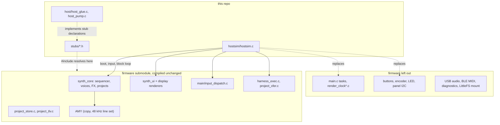

# What is not firmware code

Everything in this repo that is not the `firmware` submodule, file by file:
what it stands in for, and where the host build behaves differently from the
device. The firmware sources it compiles are compiled as they are in the
submodule, with no patches and no host-only branches.

## In numbers

| | Files | Lines of code |
|---|---|---|
| Firmware application code compiled unchanged (`components/`, `main/input_dispatch.c`; AMY and U8g2 not counted) | 84 `.c` | 24,645 |
| Firmware application code left out (drivers, tasks, USB, BLE, diagnostics; listed below) | 25 `.c` | 3,225 |
| `stubs/`: headers standing in for ESP-IDF, FreeRTOS and driver headers | 18 `.h` | 149 |
| `host/`: host implementations of what the stubs declare, plus two host tools | 4 `.c`, 1 `.h` | 379 |
| `hostsim/hostsim.c`: the program in place of `main.c` | 1 `.c` | 686 |

Counted with `scc` at firmware `d043e6eb`. Of `host/`, `frame_out.c` (~200
lines, the PNG and text frame writer) is only in the native build.

Two checks anyone can run from the repo root:

    # host-build conditionals in the firmware's application code: none
    rg -n 'HOSTSIM|AMYSYNTH_HOST|DEVSIM|__EMSCRIPTEN__' firmware/main firmware/components --glob '!**/components/amy/**'

    # every firmware file the build compiles comes from the submodule
    grep -n 'FW}' CMakeLists.txt

AMY is left out of the first check because upstream AMY has `__EMSCRIPTEN__`
branches of its own, for its web build; this build turns them off (below).
The AMY engine is compiled from a copy of `firmware/components/amy/src` with
one line changed (the sample rate).

## stubs/: headers the firmware includes

`-I stubs` comes first on the include path, so these resolve before anything
else. Fourteen stand in for ESP-IDF and component-registry headers that do
not exist on a host. Four shadow headers of the firmware's own driver
components; the driver sources behind them are not compiled.

| Header | Included by (compiled firmware) | On the host |
|---|---|---|
| `freertos/FreeRTOS.h` | `amy_helpers.h`, `sequencer_core.h`, `drone_core.c`, `synth_ui_task.c` | Types and macros. Critical sections and `IRAM_ATTR`/`DRAM_ATTR` are empty; `configASSERT` is `assert`. Declares `g_host_cur_task`, the handle `xTaskGetCurrentTaskHandle()` returns. |
| `freertos/task.h` | `amy_helpers.h`, `sequencer_core.h`, `synth_ui_task.c` | Task creation returns a handle and runs nothing. `xTaskGetTickCount()` is audio time in ms (from `hostsim.c`); `vTaskDelayUntil` advances the reference without waiting; notifications are no-ops. `xPortGetCoreID()` is 0. |
| `freertos/queue.h` | `seq_trig_pump.c` | Declarations; implemented in `host/host_glue.c`. |
| `freertos/semphr.h` | `drone_core.c`, `synth_ui_task.c` | Every take succeeds at once (one thread). |
| `esp_timer.h` | `wt_builder.c` | `esp_timer_get_time()` is audio time in us (from `hostsim.c`). |
| `esp_log.h` | 21 files | `ESP_LOGx` print to stderr, filtered by `g_host_log` (default warnings and errors; the `DEVSIM_LOG` environment variable sets it). `ESP_LOGV` prints nothing. |
| `esp_err.h` | `harness.h`, `my_buttons.h`, `usb_audio.h`, `usb_device_uac.h`, `priv_i2c_u8g2.h` | The error codes in use; `esp_err_to_name()` returns `"err"`. |
| `esp_heap_caps.h` | 9 files | `heap_caps_*` call `malloc`/`calloc`/`realloc`/`free`, ignoring the caps. The free-size queries return a constant 4 MiB. |
| `esp_partition.h` | `drum_cache.h` | A two-field `esp_partition_t`; `esp_partition_read()` is implemented in `host/host_glue.c`. |
| `esp_rom_crc.h` | `project_tlv.c` | Declaration; implemented in `host/host_glue.c`. |
| `esp_app_desc.h` | `harness_exec.c`, `seq_core_dump.c` | Version `"host"`, project `"S3-Amysynth"`. |
| `esp_idf_version.h` | `harness_exec.c` | Returns `"host"`. |
| `iot_button.h` | `my_buttons.h`, `input_dispatch.h` | The `button_event_t` enum of the espressif/button component, without the driver. |
| `usb_device_uac.h` | `harness_exec.c` | `uac_device_get_pull_stats()` returns `ESP_FAIL` (no USB). |
| `diag_heap.h` (shadows `components/diagnostics`) | `arp_core.c`, `synth_ui_task.c` | `DIAG_HEAP_CHECK` does nothing. |
| `diag_report.h` (shadows `components/diagnostics`) | `seq_trig_pump.c` | Reporter registration does nothing. |
| `project_fs.h` (shadows `components/project_store`) | `project_store.c`, `project_snapshot.c`, two project screens | Projects live in `proj/` under the working directory: on disk natively, in the module filesystem (mirrored to IndexedDB) in the browser. Init always succeeds; usage stats report 0. |
| `priv_i2c_u8g2.h` (shadows `components/display`) | `synth_ui_task.c` | Declares `i2c_u8g2_service()`, defined in `hostsim.c`. |

## host/: implementations behind the stubs

| File | What it is |
|---|---|
| `host_glue.c` | Task creation (handles only; the `seq_ui` task gets the main thread's handle, so `synth_ui_init()` registers the thread that calls `synth_ui_slice()`). Queues as unbounded FIFOs: on the device a task drains them concurrently, here the loop drains at fixed points. The `drums` partition, read from `drums.bin`. `esp_rom_crc32_le`, the same reflected CRC-32 as IDF's Linux target. `delay_ms`, which AMY's `examples.c` links against. |
| `host_pump.c` | Drains the AMY event ingest queue synchronously at points the loop chooses, where the device runs `amy_ingest_task` on Core 0. It `#include`s the firmware's `amy_helpers.c` to reach that file's private queue and urgent-drain hook, so it compiles the real file rather than a copy, and depends on those two static names. |
| `load_model.c` | The page's load meter: an estimate of device render cycles per block from measured per-oscillator and FX costs, some guessed. Reads AMY's `synth[]` and `s_fx[]` (declared in `amy_fx.h`) and writes nothing. Not a measurement. |
| `frame_out.c`, `frame_out.h` | Writes the 128x64 frame as PNG and text in replays. Native only. |

## hostsim/hostsim.c: in place of main.c

`main/main.c` is not compiled: its tasks, render timer and driver setup are
specific to the board. `hostsim.c` boots the firmware in the same order and
then drives it from one thread, one 256-frame block at a time.

Behaviour that `hostsim.c` restates from firmware code it cannot compile.
When the firmware changes one of these, `hostsim.c` has to follow by hand:

| What | Restated from |
|---|---|
| Boot order and the `amy_config_t` fields | `app_main()` in `main.c` |
| The block: ingest drain, `amy_execute_deltas()`, drain, `amy_render()`, then the render-task hooks (`sample_rec_render_tick`, `clip_bounce_render_tick`, `drum_cache_render_service`, `filter_scope_render_tick`) | the render task in `main.c` |
| Output halved after the soft clip | AMY's `ESP_PLATFORM` branch in `amy.c`, which a host build does not take |
| Long press 1500 ms, click 180 ms after release, double click dropped | the espressif/button defaults `my_buttons.c` keeps, and `main.c` |
| Encoder detents delivered every 20 ms | `encoder_task` in `main.c` |

The UI cadence is not restated: `hostsim.c` calls the public
`synth_ui_slice()` with `SYNTH_UI_SLICE_MS` and `SYNTH_UI_SLICES_PER_FRAME`
from `synth_ui.h`.

Command lines take the device's routing: a line starting `P>` goes to the
firmware's project-transfer core (`project_xfer_line()`), anything else to
`harness_exec()`, as the device's UART0 reader does. hostsim does that split
itself because the reader (`project_xfer_uart.c`) is the device's.

Functions `hostsim.c` defines in place of firmware ones:

| Function | Device | Host |
|---|---|---|
| `xTaskGetTickCount()`, `esp_timer_get_time()` | FreeRTOS tick, hardware timer | audio frames rendered, as ms and us |
| `i2c_u8g2_service()` | re-probes an absent panel; `false` when nothing was recovered | always `false`, the value of a present panel |
| `display_flush()`, `display_flush_invalidate()` | I2C transfer of the changed tiles | marks the frame for output; the buffer is read directly |
| `usb_audio_peek_levels()` | levels over the USB ring buffer | the same over a ring of the last 8192 output samples, so the output watchdog's CLIP/LOUD badge works |
| `core_load_last()`, `dropout_stats_get()` | per-core load, USB dropout counters | no data |
| `amy_platform_init()`, `amy_platform_deinit()`, `run_midi()`, `stop_midi()`, `midi_out()` (wasm only) | AMY's platform and MIDI layers | empty |

## Build-level differences

- **Configuration.** `config/sdkconfig.h` is the device's generated
  configuration header with `CONFIG_SYNTH_WIRELESS` removed: no BLE page,
  badge or live-play voice. `CONFIG_DEV_SERIAL_HARNESS`, off in the device
  configuration, is defined for `harness_exec.c` and `hostsim.c`: replays and
  the page's console send harness commands.
- **AMY.** Built from a copy of `components/amy/src` with the generic
  `AMY_SAMPLE_RATE` fallback set to 48000; the device gets 48000 from an
  `ESP_PLATFORM` branch. The defines the device's CMake derives from Kconfig
  (`AMY_WAVETABLE`, `GAMMA9001`, `AMY_USE_FIXEDPOINT`) are passed directly.
  In the wasm build AMY is compiled with `__EMSCRIPTEN__` undefined and with
  upstream AMY's `AMY_NO_MINIAUDIO` and `AMY_HOST_MIDI` switches, so it takes
  its native host path instead of its own web build.
- **Warnings.** Firmware sources, AMY and U8g2 included, compile with the
  device build's warning set (`-Wall -Wextra` with its exceptions, as in
  the firmware's compile commands), without `-Werror`; Ninja prints what
  they report for each object a build compiles. This repo's own sources
  compile with `-Wall -Wextra`. At
  firmware `d043e6eb`:
  - gcc 13.3 (native): 2. An unused variable in `display_dist.c`
    (`draw_curve`), which the device build reports too; and a possible
    truncation of the developer screen's dropout counter text
    (`ui_screen_dev.c`, `snprintf` into 48 bytes), which the device build,
    with `-Werror`, does not report.
  - clang (emcc 6.0.11): 6. The same unused variable; GCC's `optimize`
    attribute on `sequencer_core_lfo_service()`, which clang ignores, so the
    browser build compiles that function at the module's `-O2`; 4 variables
    set but not used in U8g2 drivers for panels the device does not have.
- **Generated inputs.** The template table comes from the firmware's
  `gen_templates.py`, as in the device build. `drums.bin` comes from the
  samples of the AMY release the firmware pins (`tools/gen-drums.py`).

## Firmware left out

| Firmware code | Lines | Host replacement |
|---|---|---|
| `main/main.c`, `render_clock.c`, `render_clock_i2s.c` | 671 | `hostsim.c` |
| `components/my_buttons`, `rotary_encoder`, `status_led` | 402 | key and wheel input in `hostsim.c`; no LED |
| `components/display/priv_i2c_u8g2.c`, `display_flush.c`, `display_flush_runs.c` | 332 | the frame buffer, read directly |
| `components/usb_audio/usb_audio.c`, `components/usb_device_uac` | 758 | none; audio goes to WAV or the page |
| `components/wireless` | 437 | none (`CONFIG_SYNTH_WIRELESS` off) |
| `components/diagnostics` | 481 | none; `diag_heap.h` and `diag_report.h` stubbed |
| `components/project_store/project_fs.c` (LittleFS mount) | 44 | `stubs/project_fs.h` |
| `components/harness/harness.c` (hands UART0 lines to the harness) | 25 | `hostsim.c` calls `harness_exec()` itself |
| `components/project_xfer/project_xfer_uart.c` (the UART0 reader) | 75 | `hostsim.c` sends `P>` lines to `project_xfer_line()` |

The rest of `project_store` (`project_store.c`, `project_tlv.c`) and
`usb_audio_watchdog.c` are compiled.

## Not reproduced

Two cores running at once (input and UI run between blocks here, never
during one), render timing and its budget, USB, Bluetooth, the panel's
transfer time, button bounce, PSRAM and internal RAM placement, and heap
limits.
